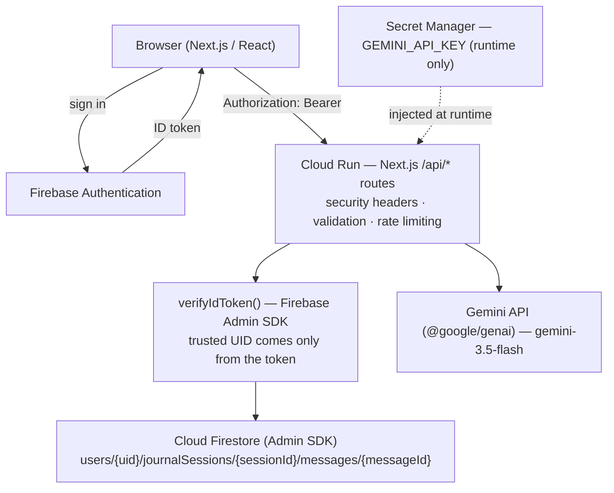

# Personal Gemini Journal

**A private, authenticated AI journal that turns a reflective conversation with Gemini into a persistent record, a plain‑language summary, and a concrete next step — running in production on Google Cloud Run.**


| | |
|---|---|
| **▶ Live demo** | <https://personal-gemini-journal-426042943892.us-central1.run.app> |
| **Source** | <https://github.com/leo-leo-691/personal-gemini-journal> |

### 30‑second overview

You already type your thoughts into AI chats — but a chat window forgets everything, has no structure, and stops at "here's a reply." Personal Gemini Journal is the container reflection actually needs: **authenticated, per‑user, persistent**, and it adds a step generic chat is missing — **turning the reflection into something to do**.

The core flow, all powered by Gemini:

```
You write a reflection  →  Multi‑turn Gemini conversation  →  Summary (understand it)
                                                           →  Action Intelligence (act on it)
                                                           →  a concrete next step
```

Every message and every AI output is stored in Cloud Firestore under your verified Firebase user ID. The browser never talks to Firestore or the Gemini API directly.

---

## 🎯 The Problem

- AI chats are **transient** — close the tab and the thread is gone.
- There is **no per‑session structure** — no way back to "the session where I worked through X."
- The output **stops at the conversation** — nothing takes you from *"I reflected"* to *"here's what I'll do."*
- General chat products aren't built as a **private, longitudinal personal record** with real server‑side data ownership.

## 💡 The Idea

A journal, not a chatbot. Each entry is a short multi‑turn conversation with Gemini acting as a reflective partner. The conversation is saved as a named session you can revisit, rename, or delete. When you're ready, one click asks Gemini for a **Summary** of the session, and one more click produces **AI Action Intelligence** — a structured breakdown that converts the reflection into ideas, observations, a checklist, and a next step.

---

## 🧠 Original Innovation — AI Action Intelligence

**Summary tells you what you said. Action Intelligence tells you what to do about it.**

```
Reflection ──▶ Gemini conversation ──▶ Summary ──▶ Action Intelligence ──▶ Concrete next step
 (you write)     (multi‑turn)          (understanding)  (follow‑through)      (do this next)
```

A summary alone is a read‑back. It closes the loop on *understanding* but not on *action*. Action Intelligence runs a **second, structured Gemini pass** over the same session (the transcript **plus** its summary as extra context) and returns a validated JSON object:

| Field | What it gives you |
|---|---|
| `keyIdeas` | The ideas from the session worth keeping |
| `insights` | Reflective observations Gemini draws from what *you* wrote |
| `actionItems` | A concrete checklist |
| `suggestedNextStep` | The single most useful next move |
| `actionPlan` | A short paragraph tying the steps together |

| | Summary | Action Intelligence |
|---|---|---|
| **Purpose** | Understanding | Follow‑through |
| **Shape** | Free‑text prose | Validated JSON, 5 named fields |
| **Direction** | Looks back | Looks forward |
| **Gemini calls** | One pass over the transcript | Second pass, also fed the summary |

**How it stays part of the journal:** Action Intelligence has no chat surface of its own. It only runs against a real session you own, its result is stored on that session's Firestore document, and it appears in the same right‑hand Insight Rail as the Summary.

**What it is *not*:** it is single‑session (this transcript + this summary). It is **not an autonomous agent**, has **no long‑term or cross‑session memory**, **takes no actions on your behalf**, and **sets no reminders**. It produces text you review and act on.

---

## 🚀 Live Demo

**<https://personal-gemini-journal-426042943892.us-central1.run.app>**

Open the production URL. `/` redirects to `/login`. Sign in with email/password or Continue with Google, start a journal session, write a reflection, then open the Insight Rail on the right and try Summary and Actions (AI Action Intelligence).

---

## ✨ Key Features

| Area | Feature |
|---|---|
| **Auth** | Firebase Authentication — email/password sign‑up + sign‑in, and Google sign‑in (popup) |
| **Privacy** | Per‑user journals; all storage keyed to the server‑verified Firebase UID |
| **Conversation** | Multi‑turn Gemini reflection; recent session history is replayed as context each turn |
| **Persistence** | Sessions and every message (yours and Gemini's) stored in Cloud Firestore |
| **Sessions** | Create (auto‑named `Journal N` per user), rename in place, delete (confirmed, with recursive message cleanup) |
| **AI Summary** | Short reflective summary of the session; a truncated or empty result is rejected, never saved |
| **AI Action Intelligence** | Structured output: Key Ideas · Insights · Action Checklist · Suggested Next Step · Action Plan |
| **UI** | "Quiet Intelligence" — three‑column desktop layout, right‑hand Insight Rail (Summary / Actions tabs), journal‑style conversation with no chat bubbles or avatars, responsive mobile sheets, dark + light theme |
| **Abuse / cost control** | Per‑user rate limiting on chat and on the expensive Gemini endpoints (`429` + `Retry-After`) |
| **Concurrency** | Firestore‑transaction guards so one session can't run two Summary or two Action Intelligence generations at once (`409`) |
| **Robustness** | Session‑ID and title validation, per‑message length cap, bounded history windows, inline non‑blocking error states |

> The Action Checklist renders **read‑only** — the schema stores `actionItems` as strings only, so the app does not fake persisted checkbox completion.

---

## 🏗️ Architecture



The browser talks only to **Firebase Authentication** (to sign in) and to the app's own **`/api/*` routes**. It **never** connects to Firestore or the Gemini API directly. Every API route verifies the caller's Firebase ID token before doing any work. Cloud Run runs the app as a **dedicated service account** and reaches Google APIs through **Application Default Credentials** — there is no service‑account JSON key in the repo or the container image.

---

## ☁️ Google Technology Integration

| Google technology | Role in this project |
|---|---|
| **Firebase Authentication** | User identity — email/password + Google. Issues the ID token every API call must carry. |
| **Cloud Firestore** | The persistent journal — sessions, messages, summaries, and Action Intelligence, all under `users/{uid}/…`. Client rules are deny‑all. |
| **Gemini API** (`@google/genai`, `gemini-3.5-flash`) | The reasoning engine for all three AI operations: conversation, Summary, Action Intelligence. |
| **Google Cloud Run** | Production hosting — the standalone Next.js server, a dedicated runtime service account, autoscaling. |
| **Google Cloud Secret Manager** | Injected into the Cloud Run service as the `GEMINI_API_KEY` environment variable from Secret Manager at runtime; never in source, build args, or the client bundle. |

These are load‑bearing, not decorative — remove any one and a core feature stops working.

---

## 🔐 Security & Privacy

> **The client never tells the server which user it is.** The server derives the UID from the verified Firebase ID token and builds every Firestore path from that UID — a user can only ever reach their own data.

| Control | What it prevents / guarantees |
|---|---|
| Firebase ID‑token verification on every route (`verifyIdToken()`) | Missing, malformed, expired, or revoked tokens are rejected with `401` before any work happens |
| UID taken **only** from the verified token | A `uid` in the request body is ignored — UID spoofing has no effect |
| UID‑scoped Firestore paths (`users/{verifiedUid}/journalSessions/…`) | IDOR — another user's `sessionId` resolves to a path that doesn't exist for the caller → `404` |
| `checkRevoked: true` on `DELETE` | A disabled/revoked account can't delete, even with a not‑yet‑expired token |
| Session‑ID validation (`^[A-Za-z0-9_-]{1,128}$`) | Path traversal (a `/` would become extra Firestore path segments) and oversized‑key abuse |
| Title validation (1–80 chars, trimmed) | Empty / whitespace / oversized titles → `400` |
| Per‑user rate limits (chat 30/min; Summary & Actions 10 per 5 min) | Runaway Gemini cost / endpoint abuse → `429` with `Retry-After` |
| Firestore‑transaction concurrency guards (Summary flag; Actions 5‑minute lease) | Duplicate/racing generations for one session → `409`; a crashed Actions run self‑heals when its lease goes stale |
| Deny‑all Firestore Security Rules (`allow read, write: if false`) | The database has no client‑reachable surface — all access is server‑mediated and explicitly authorized |
| Gemini key via Secret Manager, runtime only | The credential is never in source, build args, the browser bundle, or a `NEXT_PUBLIC_*` variable |
| ADC + dedicated Cloud Run service account | No service‑account JSON key file exists in the repo or image |
| Security headers on every response (HSTS, CSP, `X-Frame-Options: DENY`, `nosniff`, Referrer‑Policy, Permissions‑Policy) | Clickjacking, MIME sniffing, referrer leakage, unwanted browser APIs |
| Bearer‑token auth, no auth cookies | CSRF has no ambient credential to exploit |
| Generic client errors; details only in server logs | Internals and provider errors aren't leaked in responses (Gemini quota → `503`, app failure → `500`) |
| System instruction treats journal text as data, structured output is schema‑validated | Basic prompt‑injection posture |

`.env.example` contains placeholders only; `.env*` files are git‑ignored. No secret values appear in this repository or this README.

---

## 🤖 How Gemini Is Used

All three operations run server‑side in `src/server/gemini.ts` via the `@google/genai` SDK, model **`gemini-3.5-flash`**.

| Operation | Input | Gemini's role | Output | Persistence |
|---|---|---|---|---|
| **Journal conversation** (`POST /api/chat`) | Recent session history (~20 messages) + your new entry, role‑tagged | Reflective journal partner | A contextual reply | User message saved before the call, model reply saved after |
| **Summary** (`POST /api/summarize`) | Session transcript (~50 messages) | Condense the session into 3–5 finished sentences | Plain‑text reflective summary | Saved on the session document — a truncated (`MAX_TOKENS`) or empty result is **rejected, not saved** |
| **Action Intelligence** (`POST /api/action-plan`) | Transcript + the session's stored summary | Extract structure and next steps | Validated JSON: `keyIdeas`, `insights`, `actionItems`, `suggestedNextStep`, `actionPlan` | Saved on the session document — malformed/truncated JSON is **rejected, not shown** |

**Failure handling:** Gemini quota/availability errors surface as `503`; other generation errors as `500` with a safe message; the conversation endpoint degrades to a short fallback line so the journal never hard‑fails mid‑entry. Concurrency guards are always released.

**Credentials:** `process.env.GEMINI_API_KEY` is populated only at Cloud Run runtime from Secret Manager. If it's missing, the code logs a warning and calls fail loudly rather than using a fake key.

---

## 🗃️ Data Model

Cloud Firestore, keyed entirely by the **server‑verified UID**:

```
users/{uid}/journalSessions/{sessionId}
    title, createdAt, updatedAt, lastMessageAt
    summary                                       last generated Summary (string)
    actionIntelligence                            last Action Intelligence (5 fields) | null
    summaryInProgress                             Summary concurrency flag
    actionPlanInProgress + actionPlanStartedAt    Action Intelligence 5-minute lease

users/{uid}/journalSessions/{sessionId}/messages/{messageId}
    role ("user" | "model")
    text  (capped at 4,000 characters on write)
    ts
```

**Why this isolates users:** there is no top‑level `sessions` collection to query. A session exists only *inside* one user's subtree, and the server builds that path from the token‑derived UID. A request for another user's `sessionId` resolves to a non‑existent document under the caller's own subtree → `404`. No code path reads or writes outside `users/{verifiedUid}/…`.

---

## 🔄 User Journey

1. Sign up / sign in via Firebase Authentication (email + password, or Google popup).
2. Firebase issues an **ID token**; the client attaches it to every API call as `Authorization: Bearer <token>`.
3. Create or select a journal session.
4. Write a reflection and send it.
5. The API route verifies the token (`401` if bad/missing), derives the **UID from the token only**, and confirms the session belongs to that UID.
6. Your message is persisted, then history + your message go to Gemini; Gemini's reply is persisted and returned.
7. Open the Insight Rail for **Summary** and/or **Action Intelligence** — each auth‑checked, rate‑limited, and concurrency‑guarded; results are saved onto the session.

---

## 🛡️ Production Security Verification

Verified against the **deployed** service (revision `personal-gemini-journal-00004-2f9`, 100% traffic):

| Check | Result |
|---|---|
| Public routing & login endpoint | PASS — `/` redirects to `/login`; `/login` returns `200` |
| Unauthenticated / bad‑token request → `401` | PASS |
| Cross‑user IDOR (read, delete, Action Intelligence on another user's session) | PASS — `404` |
| UID spoofing via request body | PASS — ignored |
| Session deletion | PASS |
| Real multi‑turn Gemini conversation with per‑session context | PASS |
| Firestore message persistence | PASS |
| Gemini Summary | PASS |
| Gemini Action Intelligence | PASS |
| Action Intelligence concurrency protection → `409` | PASS |
| Security headers present on responses | PASS |
| No secrets in production bundles or logs | PASS |

| Deployment fact | Value |
|---|---|
| Service / Region / Project | `personal-gemini-journal` · `us-central1` · `geminijournal-507414` |
| Serving revision | `personal-gemini-journal-00004-2f9` (100% traffic) |
| Challenge label | `dev-tutorial=cloud-run-ai-challenge` |
| Runtime service account | `journal-runner@geminijournal-507414.iam.gserviceaccount.com` |
| Gemini credential | `GEMINI_API_KEY` ← Secret Manager `gemini-api-key:1` (runtime only) |

---

## 🧪 Testing & Quality

| Check | Result |
|---|---|
| `npm test` (Vitest) | **96 / 96 passing**, **15 test files** |
| `npx tsc --noEmit` | passing (TypeScript `strict`) |
| `npm run build` (`next build`) | passing |
| Production end‑to‑end verification | passing (above) |
| Static secret scan (`AIza…` / private‑key patterns) | passing |

The tests cover:

- **Authorization & isolation** — 401s, cross‑user IDOR, UID‑spoofing, session‑ID validation on every route.
- **Security headers** — every required header is configured.
- **Concurrency** — the Action Intelligence lease (acquire / reclaim‑when‑stale / release) and the Summary transaction guard.
- **Gemini failure handling** — truncated and empty responses are rejected and never persisted; quota errors map to `503`; malformed JSON becomes a typed error, not a crash.
- **Session rename / date handling / default titles** — ownership‑checked rename, timestamps never render `Invalid Date`, missing dates never become "now".
- **UI behaviour** — title‑only heading, one metadata line, no chat bubbles, inline send‑error with optimistic‑message rollback, and the rule that a failed generation never shows stale insights beside an error.

This is a hackathon build. The tests and verification give confidence in the core paths; they are not a claim of being bug‑free or "100% secure."

---

## 🎨 Quiet Intelligence Design

The UI is deliberately a **journal**, not a messenger:

- **Journal‑first** — writing gets the widest column and the largest type; AI output lives in the margin and a side rail.
- **Editorial typography** — Newsreader (serif) for journal text, Manrope for UI, JetBrains Mono for metadata, self‑hosted via `next/font` so it complies with the app's CSP.
- **No chat bubbles, no avatars** — your entries are full‑width serif text; Gemini replies are indented behind a hairline rule with a small "Gemini" label. It reads like a page.
- **Insight Rail** — Summary and Action Intelligence as two tabs of one right‑hand surface.
- **Dark + light theme**, resolved before hydration (no flash), remembered per browser.
- **Responsive** — the three columns collapse to sheets on tablet and mobile.

---

## 📊 Why This Is More Than a Chatbot

| Generic AI chatbot | Personal Gemini Journal |
|---|---|
| Transient conversation, lost on close | Authenticated account, **persistent** sessions in Firestore |
| One shared thread | **Per‑user isolated** journals; named, renamable, deletable sessions |
| Generic assistant | A reflective **journal partner**, session‑scoped context |
| Output ends at the reply | Reply **→ Summary → Action Intelligence** (structured, validated) |
| No reflection‑to‑action step | Key ideas, insights, a checklist, and a next step |
| "The chat" *is* the data model | Explicit Firestore schema, UID‑scoped, server‑authorized |
| Runs "somewhere" | Production Cloud Run, dedicated service account, Secret Manager |

---

## 🏆 Hackathon Requirements

- [x] **Firebase Authentication** — email/password (sign‑up + sign‑in) and Google popup
- [x] **Real multi‑turn Gemini API interaction** — `@google/genai`, `gemini-3.5-flash`, session history replayed as context, replies persisted
- [x] **User‑isolated Firestore storage** — everything under `users/{verifiedUid}/journalSessions/…`, deny‑all client rules
- [x] **Gemini credential protected with Google Cloud Secret Manager** — runtime‑only, never in the bundle or build args
- [x] **Original enhancement — AI Action Intelligence** — structured, validated reflection‑to‑action output attached to the session
- [x] **Production deployment on Cloud Run** — `us-central1`, dedicated runtime service account, ADC (no key file)
- [x] **Public repository** — <https://github.com/leo-leo-691/personal-gemini-journal>

---

## 🖥️ Local Development

**Prerequisites:** Node.js 18+, a Firebase project (Authentication with Email/Password + Google providers, and Cloud Firestore enabled), the `gcloud` CLI, and a Gemini API key.

```bash
git clone https://github.com/leo-leo-691/personal-gemini-journal.git
cd personal-gemini-journal
npm install
cp .env.example .env.local      # then fill in YOUR OWN values

gcloud auth application-default login       # Firebase Admin uses ADC — no JSON key
firebase deploy --only firestore:rules      # push the deny-all rules to your project

npm test        # 96 tests
npm run build   # production build
npm run dev     # http://localhost:3000
```

Two distinct kinds of configuration — **do not mix them**:

The Gemini key is passed only as a runtime secret from Secret Manager; it is never passed as a build argument or exposed as a public variable. Firebase Web configuration is separate public client configuration and may be supplied at build time.

| Variables | What they are | Sensitivity |
|---|---|---|
| `NEXT_PUBLIC_FIREBASE_*` | Public Firebase **Web App** config. Next.js inlines these into the browser bundle at build time — expected for Firebase web config. | Not secret |
| `GEMINI_API_KEY` | **Server‑only** Gemini credential, read only in `src/server/**`. In production it comes from Secret Manager at runtime. | **Secret — never commit, never `NEXT_PUBLIC_*`, never a build arg** |

---

## 🚀 Deployment

Google Cloud Run (`us-central1`), built from source with a multi‑stage Docker image (`node:20-alpine`, non‑root user, standalone Next.js server on port `8080`).

Principles: a **dedicated runtime service account** with least‑privilege roles (Datastore user + Firebase Auth viewer) authenticating via **ADC** (no JSON key); **public Firebase web config** passed at build time; the **Gemini key** passed as a **runtime secret** from Secret Manager (never as a build argument or public variable).

```bash
# Store the Gemini key in Secret Manager (value from a local file you never commit)
gcloud secrets create YOUR_SECRET_NAME --project YOUR_PROJECT_ID --replication-policy automatic
gcloud secrets versions add YOUR_SECRET_NAME --data-file=./gemini-key.txt

# Deploy
gcloud run deploy personal-gemini-journal \
  --project YOUR_PROJECT_ID --region us-central1 --source . \
  --service-account journal-runner@YOUR_PROJECT_ID.iam.gserviceaccount.com \
  --allow-unauthenticated \
  --set-secrets GEMINI_API_KEY=YOUR_SECRET_NAME:1 \
  --set-build-env-vars NEXT_PUBLIC_FIREBASE_API_KEY=YOUR_FIREBASE_API_KEY,NEXT_PUBLIC_FIREBASE_AUTH_DOMAIN=YOUR_PROJECT.firebaseapp.com,NEXT_PUBLIC_FIREBASE_PROJECT_ID=YOUR_PROJECT_ID,NEXT_PUBLIC_FIREBASE_APP_ID=YOUR_FIREBASE_APP_ID \
  --set-env-vars NEXT_PUBLIC_FIREBASE_PROJECT_ID=YOUR_PROJECT_ID,NEXT_PUBLIC_FIREBASE_AUTH_DOMAIN=YOUR_PROJECT.firebaseapp.com,NEXT_PUBLIC_FIREBASE_APP_ID=YOUR_FIREBASE_APP_ID
```

The Cloud Run endpoint is publicly reachable (`--allow-unauthenticated`); **application‑level** Firebase auth and server‑side authorization gate every operation and every byte of data.

---

## 📁 Project Structure

```
src/
├── app/
│   ├── api/
│   │   ├── chat/route.ts                 multi-turn Gemini reply (auth · rate limit · persist)
│   │   ├── entries/route.ts              list / create sessions
│   │   ├── entries/[sessionId]/route.ts  get · rename (PATCH) · delete (checkRevoked)
│   │   ├── summarize/route.ts            Gemini Summary (transaction guard → 409)
│   │   └── action-plan/route.ts          Action Intelligence (5-min lease → 409)
│   ├── login/page.tsx · journal/page.tsx · layout.tsx
├── components/          Sidebar · SessionHeader · Conversation · Composer · InsightRail ·
│                        SummaryModal · ActionPlanPanel · DeleteSessionModal · ThemeToggle
├── lib/                 firebase-client (Auth + authenticatedFetch) · action-plan-client ·
│                        format-date · useRenameSession
└── server/   *** server-only, never shipped to the browser ***
    ├── firebase-admin.ts   Admin SDK (ADC) · verifyIdToken()
    ├── firestore-db.ts     all Firestore access, UID-scoped · concurrency guards / lease
    ├── gemini.ts           @google/genai client · gemini-3.5-flash · 3 operations
    ├── rate-limit.ts       best-effort in-memory per-user limiter
    └── validation.ts       isValidSessionId() · normalizeTitle()

tests/            15 files, 96 tests
security/         architecture.md · security-constitution.md · threat-model.md
firestore.rules   deny-all
next.config.js    standalone output + security headers (incl. CSP)
Dockerfile        multi-stage · non-root · port 8080
```

---

## 🔮 Future Improvements

*Not implemented — realistic next steps:*

- **Durable, distributed rate limiting** — replace the in‑memory per‑instance limiter with a shared store for a hard global quota.
- **Cross‑session analytics** — themes and trends over time (Action Intelligence is single‑session today).
- **Configurable reflection templates** — user‑selectable prompt styles.
- **A lease for the Summary guard** — matching the Action Intelligence lease, so a crashed summary self‑heals.
- **Improved observability** — structured request logging, tracing, per‑endpoint metrics and alerts.

---

## 👨‍💻 Built With

- **Next.js 14.2.3** (App Router) · **React 18.3** · **TypeScript** (strict) · **Tailwind CSS 3.4**
- **Firebase 10** (client Auth) · **firebase-admin 12** (server: token verification + Firestore)
- **Google Gen AI SDK** (`@google/genai` 0.2) — model **`gemini-3.5-flash`**
- **Google Cloud Run** · **Google Cloud Secret Manager** · **Cloud Firestore**
- **Vitest 1.6** + **@testing-library/react** + **jsdom** · **Docker** (multi‑stage `node:20-alpine`)

## 📄 License

No `LICENSE` file is currently included in this repository. All rights reserved by the author unless one is added.
